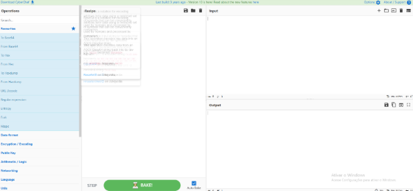
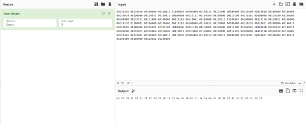
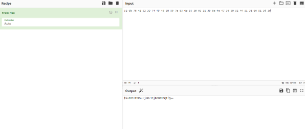
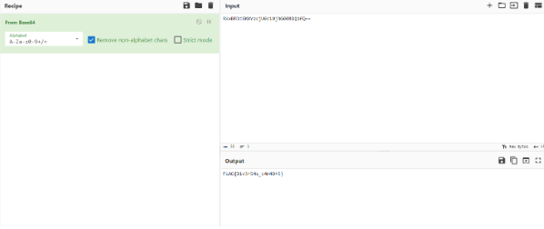
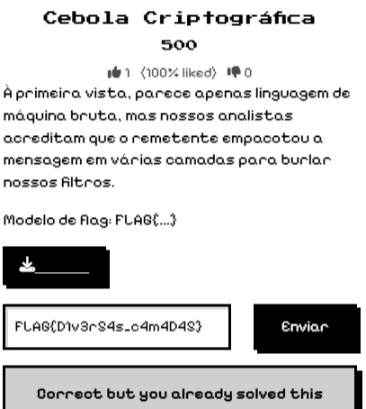

# Cebola Criptográfica

Categoria: Crypto

Autor: Professores

## Introdução 

Desafio básico sobre cyber security(nesse caso sobre criptografia) em que os autores foram os professores para dar um exemplo de um exercício de nível fácil de CTF. Usei nesse exercício a ferramenta do cyberchef.

## Análise 
### Dica / Enunciado:

*“À primeira vista, parece apenas linguagem de máquina bruta, mas nossos analistas acreditam que o remetente empacotou a mensagem em várias camadas para burlar nossos filtros.
Modelo de flag: FLAG{...}”*

Juntamente a esse enunciado foi dado um arquivo.txt, que dentro tinha o código binário a baixo:

*“00110101 00110010 00100000 00110110 01100010 00100000 00110111 00111000 00100000 00110100 00110010 00100000 00110101 00110010 00100000 00110011 00110011 00100000 00110111 00110100 00100000 00110100 00110101 00100000 00110100 01100100 00100000 00110101 00111000 00100000 00110101 00111001 00100000 00110111 01100001 00100000 00110110 00110011 00100000 00110110 01100001 00100000 00110101 00110101 00100000 00110011 00110000 00100000 00110110 00110011 00100000 00110011 00110001 00100000 00110011 00111001 00100000 00110110 01100001 00100000 00110100 01100101 00100000 00110100 00110111 00100000 00110011 00110000 00100000 00110011 00110000 00100000 00110101 00110010 00100000 00110100 00110100 00100000 00110101 00110001 00100000 00110011 00110001 00100000 00110110 00110110 00100000 00110101 00110001 00100000 00110011 01100100 00100000 00110011 01100100”*

## Interpretação

Como o enunciado falou de mensagem de várias camadas, induz a ter que modificar a mensagem diversas vezes para a obtenção da flag, então, a primeira coisa que fiz para resolver esse exercício foi abrir o “cyberchef”, uma ferramenta de web disponível de graça para manusear mensagens ou códigos criptografados. 

## Resolução
Como cada grupo possui 8 bits, representando um caractere, transformei a linguagem de máquina bruta obtendo então:

                     “52 6b 78 42 52 33 74 45 4d 58 59 7a 63 6a 55 30 63 31 39 6a 4e 47 30 30 52 44 51 31 66 51 3d 3d”

Com esse código é  possível deduzir que é hexadecimal, uma vez que, possui números de ‘0’ a 9’, letras  de ‘A’ a ‘Z’ e está dividido em pares, assim então, transformo cada decimal em um caractere, recebendo o código de uma nova foma como mostrado abaixo:

                                                        “RkxBR3tEMXYzcjU0c19jNG00RDQ1fQ==”

Pelo formato, deduzi que era Base64, já que tem letras maiúsculas e minúsculas de ‘A’ a ‘Z’, números de ‘0 a ‘9’ e como às vezes termina com o sinal de ‘=’ ou “==”, minha primeira suspeita foi essa, então na ferramenta do cyberchef modifiquei o código q antes estava em Base64, e obtive então a flag abaixo:

                                                          “FLAG{D1v3r54s_c4m4D45}”

## Conclusão

Esse foi um desafio que lidava com manipulação do arquivo que foi compartilhado pelo exercício, não foi complicado, visto que precisei só utilizar das ferramentas de web, entretanto, consegui aprender mais sobre diferentes partes da parte de criptoafia.

