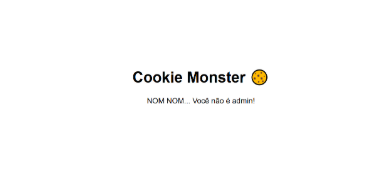
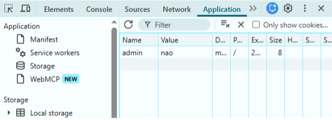
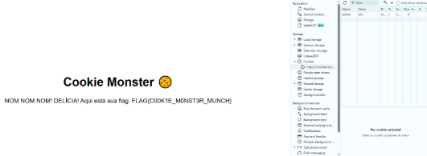
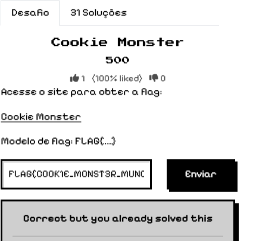

# Cookie Monster

Categoria: Web Exploitation

Autor: Professores

## Introdução 

Desafio básico sobre Web Exploitation em que os autores foram os professores para dar um exemplo de um exercício de nível fácil de CTF. O desafio consiste em analisar e inspecionar um website em busca de uma informação escondida ou de uma alteração dos cookies do site, como neste desafio. 

## Análise 
### Dica / Enunciado:

                                                “Acesse o site para obter a flag:
                                                        Cookie Monster
                                                  Modelo de flag: FLAG{...}”

## Interpretação
Ao clicar na parte escrita cookie monster, abrimos um site em uma nova aba, e como o enunciado sugere, para achar a flag, os cookies do site tem extrema importância nesse processo.

## Resolução
Ao clicar no link do cookie monster, somos levados a site falando que não sou admin como mostra a imagem abaixo:

Após esse texto, ficou claro que a resolução deveria ser aumentando meu “valor” no site. Sendo assim, inspeciono o site e vou até a aba dos cookies e me deparo com esse valor para o admin:

Então simplesmente troco o valor de admin para sim, para conseguir acesso maior ao site e após recarregar a página, recebo uma nova mensagem: 

Cookie Monster de novo, mas agora a mensagem abaixo disso é a resposta para o desafio, com a flag:

                                                “FLAG{C00K1E_M0NST3R_MUNCH}“

## Conclusão

Um desafio bem básico sobre web exploitation, em que não precisa saber muito a fundo sobre cibersegurança, apenas o básico seria o suficiente para resolver, mas é um bom desafio introdutório, dando dicas de forma direta e cômica, sem muitas complicações.

 
